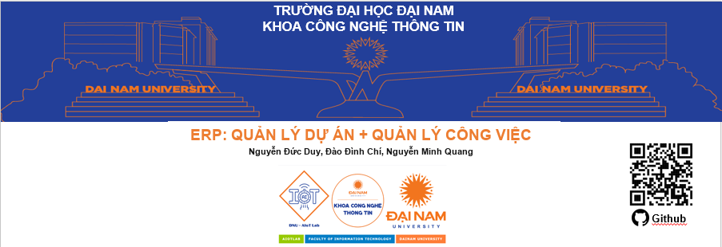
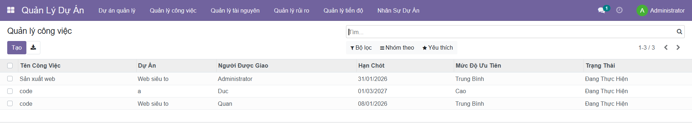
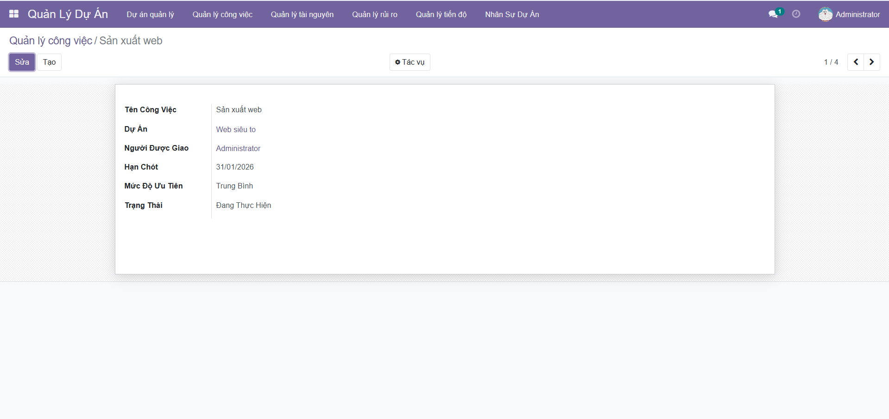
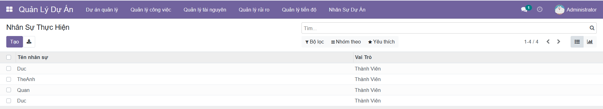

  

<h3 align="center">Hệ điều hành</h3>

  

<h3 align="center">Công nghệ chính</h3>

  
  
  
  

<h3 align="center">Cơ sở dữ liệu</h3>

  

## 1. Giới thiệu hệ thống

Hệ thống **ERP – Quản lý Dự Án** được xây dựng nhằm hỗ trợ quản lý, theo dõi và
điều phối các dự án trong một tổ chức một cách hiệu quả và tập trung.

Hệ thống cung cấp các công cụ giúp nhà quản lý kiểm soát toàn bộ vòng đời của dự án,
từ khâu khởi tạo, phân chia công việc, theo dõi tiến độ cho đến đánh giá kết quả thực hiện.

### Các chức năng chính của hệ thống bao gồm:
- Dashboard tổng quan dự án (số lượng dự án, công việc, giá trị và trạng thái)
- Quản lý loại dự án và loại công việc
- Phân chia và giao việc cho các thành viên
- Quản lý dự án và quản lý công việc
- Theo dõi và quản lý tiến độ thực hiện dự án

Hệ thống được phát triển trên nền tảng **Odoo**, giúp dễ dàng mở rộng, tích hợp
và đáp ứng nhu cầu quản lý dự án trong môi trường doanh nghiệp và tổ chức giáo dục.

## 1. Giao điện ứng dụng

  

  

  

